# Informe de Laboratorio 3.2: Infraestructura de Red con VLANs

**Asignatura:** Infraestructura, Plataformas Tecnologicas y Redes (SIS313)
**Semestre:** 1/2026
**Institución:** Universidad San Francisco Xavier de Chuquisaca
**Estudiantes:** Chambi Lopez Naydelin
                 Cruz Romero Lilian Ariel 


## 1. Introducción
Este informe detalla la implementación de una red segmentada mediante VLANs (Virtual LANs) utilizando el estándar IEEE 802.1Q. La arquitectura permite separar lógicamente los departamentos de una organización (TI, Ventas, Contabilidad y DMZ) sobre una misma infraestructura física, mejorando la seguridad y eficiencia del tráfico de red.

## 2. Objetivos
* Configurar un Router basado en Ubuntu Server para gestionar el etiquetado de tramas y enrutamiento inter-VLAN.
* Implementar políticas de seguridad restrictivas mediante el firewall UFW.
* Configurar estaciones de trabajo sobre Alpine Linux con interfaces virtuales específicas.
* Validar el acceso controlado a Internet y la conectividad entre subredes.
## 3. Esquema Logico de organizacion 
A continuación se detalla la jerarquía de red implementada para la segmentación departamental:

Nivel Lógico,Departamento / Zona,ID VLAN,Subred Asociada,Gateway (IP Router)

* Nivel Lógico,Departamento / Zona,ID VLAN,Subred Asociada,Gateway (IP Router)
* Núcleo (Gateway),Infraestructura Central,--,N/A,N/A
* Zona Perimetral,DMZ (Servidores),10,192.168.10.0/29,192.168.10.1
* Zona Interna 1,TI (Administración),20,192.168.20.0/29,192.168.20.1
* Zona Interna 2,Ventas (Operaciones),30,192.168.30.0/27,192.168.30.1
* Zona Interna 3,Contabilidad (Finanzas),40,192.168.40.0/29,192.168.40.1

## 4. Diagrama de Conexiones 
 El flujo de datos se gestiona a través de un enlace Trunk que conecta el Router con el Switch Virtual, distribuyendo el tráfico etiquetado a cada nodo:

```

 +-------------------------------------------------+
       |                  HIPERVISOR (HOST)              |
       |                                                 |
       |   +--------------+      +------------------+     |
+------>   | Router-Linux |      |  Nube Internet   |     |
|      |   | (enp0s3:NAT) |<-----> (Acceso Externo) |     |
|      |   +------+-------+      +------------------+     |
|      |          | enp0s8                                |
|      |          | (TRUNK)                               |
|      |          v                                       |
|      |   +------+----------------------------------+    |
|      |   |        Switch Virtual (Red Interna)       |    |
|      |   +--+-------+--------+--------+------------+    |
|      |      |VLAN10 |VLAN20  |VLAN30  |VLAN40          |
|      |      |       |        |        |                |
|      |   +--v--+ +--v--+  +--v--+  +--v--+             |
|      |   | DMZ1| | TI  |  | Vent|  | Cont|             |
|      |   +-----+ +-----+  +-----+  +-----+             |
|      |                                                 |
+------+-------------------------------------------------+

```
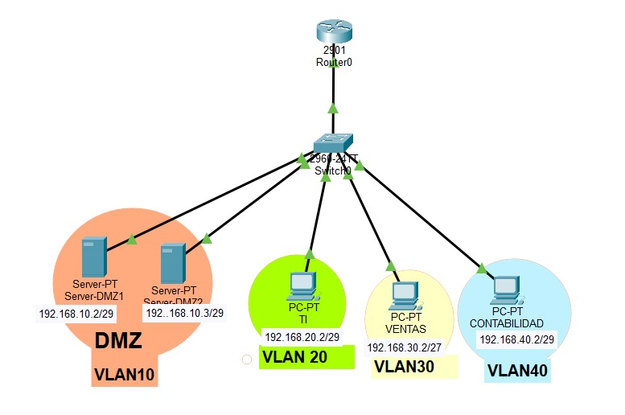

## 5. Realización: Configuración del Router (Ubuntu Server)
El router actúa como la pieza central de la red, gestionando el tráfico entre las diferentes VLANs y hacia la red externa (Internet).

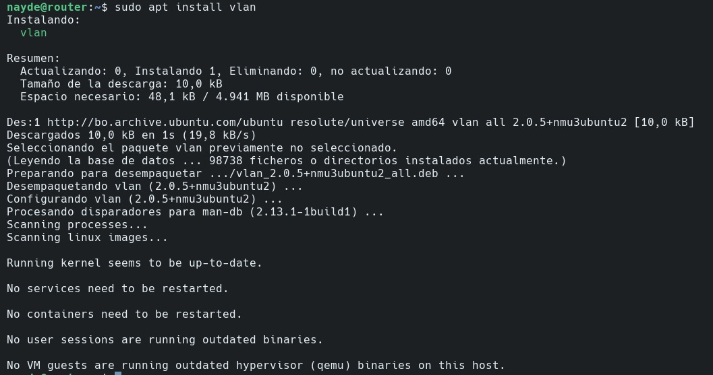

### 5.1. Configuración de Interfaces y VLANs
Se instaló el paquete `vlan` y se configuraron las sub-interfaces en el archivo Netplan (`/etc/netplan/50-cloud-init.yaml`). Cada sub-interfaz (vlan10, vlan20, vlan30, vlan40) se asoció a la interfaz física `enp0s8`.

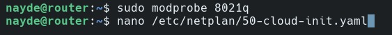

### 5.2. Enrutamiento y NAT
Para permitir la navegación de los departamentos, se habilitó el reenvío de paquetes en el kernel mediante la edición de `/etc/sysctl.conf` estableciendo `net.ipv4.ip_forward=1`. 
Se configuró el enmascaramiento (MASQUERADE) en el archivo `/etc/ufw/before.rules` para las subredes autorizadas:
- `-A POSTROUTING -s 192.168.20.0/24 -o enp0s3 -j MASQUERADE`
- `-A POSTROUTING -s 192.168.40.0/24 -o enp0s3 -j MASQUERADE`

### 5.3. Políticas de Firewall (UFW)
Se establecieron reglas de ruta específicas para controlar el flujo entre departamentos:
- `sudo ufw route allow in on vlan40 out on vlan30` (Contabilidad a Ventas permitido).
- `sudo ufw route deny in on vlan10 out on vlan20` (DMZ aislada de TI).

## 6. Realización: Configuración de las VMs (Estaciones de Trabajo)
Las máquinas virtuales de los departamentos se configuraron de forma independiente para operar dentro de sus respectivos dominios de difusión utilizando Alpine Linux.

### 6.1. Configuración en PC Contabilidad (VLAN 40)
Se configuró la interfaz virtual `eth0.40` con los siguientes parámetros:
- **IP:** 192.168.40.2/29
- **Gateway:** 192.168.40.1
- **Archivo:** `/etc/network/interfaces`

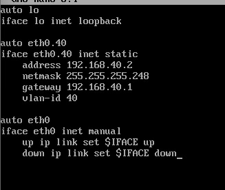

### 6.2. Configuración en PC Ventas (VLAN 30)
Se configuró la interfaz virtual `eth0.30`:
- **IP:** 192.168.30.2/27
- **Gateway:** 192.168.30.1
- **Acceso:** Restringido a internet por políticas de firewall en el router.

## 7. Pruebas de Funcionamiento y Resultados
* **Conectividad Interna:**
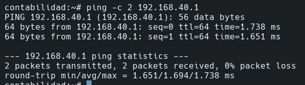

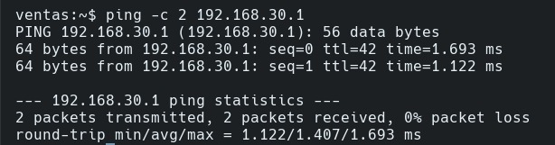

* **Conectividad Externa:** Se confirmó que Contabilidad tiene acceso a Internet (ping a 8.8.8.8 exitoso) mientras que Ventas deberia estar bloqueado.
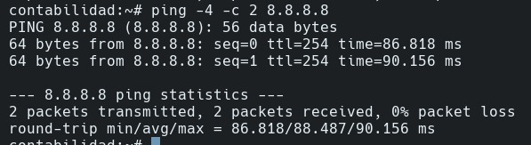
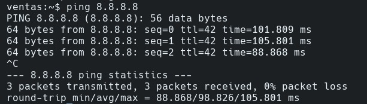

**Como vemos no esta bloqueado por lo que debemos configurar lo siguiente:**

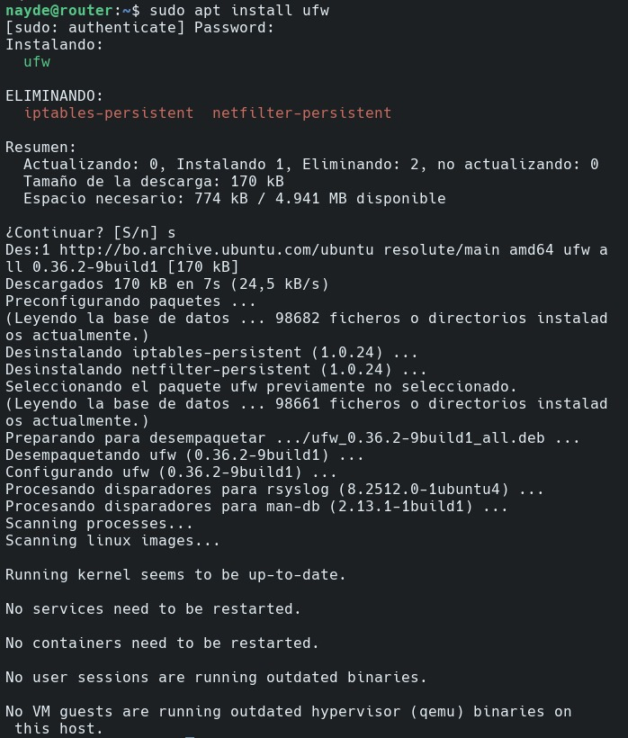

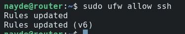

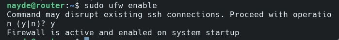

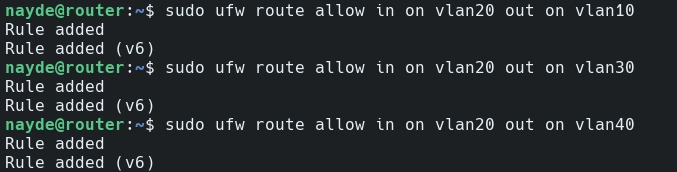

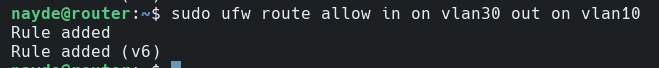

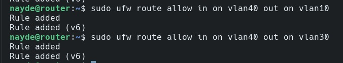

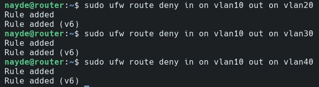

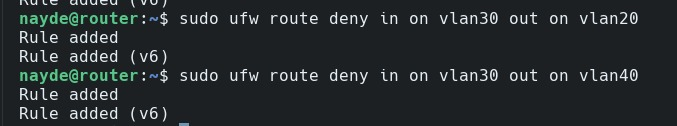

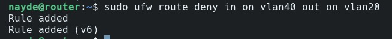


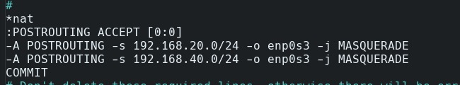

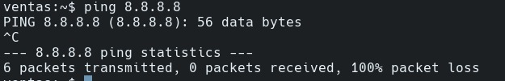

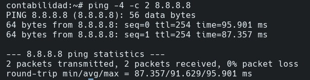

* **Acceso Inter-VLAN:** Se validó la conexión SSH desde Contabilidad (192.168.40.2) hacia Ventas (192.168.30.2), confirmando que el router permite el salto entre estas VLANs específicas.

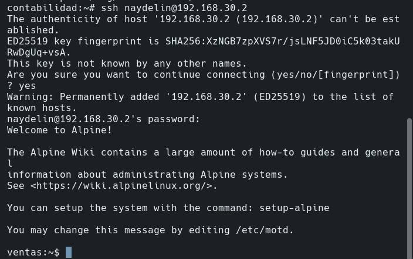

* **Aislamiento:** Se verificó que las reglas de denegación impiden que la DMZ inicie conexiones hacia las redes internas de administración.
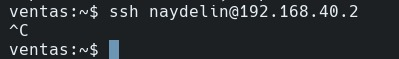

## 7. Conclusiones
La ejecución de este laboratorio permitió validar que la segmentación mediante VLANs bajo el estándar IEEE 802.1Q es una estrategia crítica para la seguridad y el rendimiento en redes organizacionales. A partir de los resultados obtenidos, se concluye lo siguiente:  
* Optimización del Dominio de Difusión: Se logró reducir el tráfico innecesario en la red al confinar los paquetes de "broadcast" dentro de sus respectivas etiquetas (ID), evitando la saturación de interfaces en departamentos no relacionados.  

* Seguridad Granular y Control Perimetral: La implementación de políticas de Firewall mediante UFW (Uncomplicated Firewall) a nivel de ruta demostró ser efectiva para mitigar riesgos internos. La capacidad de aislar la DMZ y restringir el acceso de Ventas hacia el exterior, mientras se permite el flujo total a TI, garantiza el cumplimiento del "Principio de Menor Privilegio".  

* Versatilidad del Enrutamiento Linux: Se comprobó que un servidor con Ubuntu Server puede operar como un Router/Gateway empresarial de alto desempeño, gestionando eficientemente el NAT (Network Address Translation) y el reenvío de paquetes entre múltiples sub-interfaces virtuales.

*  Independencia y Escalabilidad: La separación técnica entre la lógica del router y la configuración de las estaciones Alpine Linux asegura que la red sea escalable. Es posible añadir o reubicar nodos físicos sin alterar la estructura lógica ni comprometer las políticas de seguridad preestablecidas.  

En definitiva, la arquitectura diseñada no solo organiza los activos de la empresa, sino que construye una infraestructura resiliente donde la visibilidad y el acceso están estrictamente definidos por la función administrativa y no por la ubicación física. 
